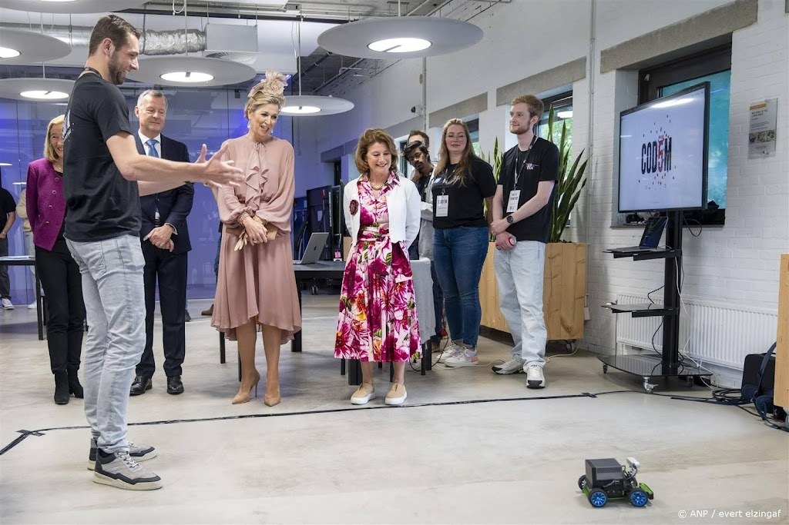

 

  
<h1 align="center">AUTONOMOUS-VEHICLE-INTERNSHIP</h1>

---

## Introduction

**TELEANN** works on an **Autonomous Forklift** — a cutting-edge solution designed to revolutionize the warehouse environment by automating the movement of items between various points. This system enhances efficiency, reduces costs, and minimizes human error. The forklifts are retrofitted with our hardware and software kit, making it compatible with all types of existing forklifts.

In the context of this internship project, my focus was on **real-time object detection and navigation** using **ROS** (Robot Operating System). The internship involves integrating **software, hardware, and AI** components to create a robust autonomous forklift prototype. 

## My key contributions included: 

**Modifying Library Wrappers**: I customized and extended wrappers around key robotics libraries, ensuring seamless integration with our system requirements.  
**Ensuring Seamless Communication**: By standardizing data exchange between C++ and Python processes, I enabled secure, real-time communication across various modules.  
**Developing Motor Control Interfaces**: I designed and implemented a specialized control component (akin to a “PCI controller”) for the PiRacer platform, handling steering, speed regulation, and sensor feedback based on real-time 3D data from ROS.  

For the software developement we used C++ and python extensively as they are the main language in which ROS operates. **Notably, TELEANN has recently raised over €200,000 to continue developing this solution using the same core software stack. At the end of the internship, I was offered a full-time contract.** 

(<a href="#top">back to top</a>)

---
## Core Objective
Eliminate manual item transport in warehouses by automating forklifts. This boosts efficiency, cuts costs, and frees human labor for more advanced tasks.

## Target Market
Designed for medium- to large-scale warehouses, distribution centers, and manufacturing facilities aiming to automate internal logistics and enhance operations.

## Key Features
1. **Autonomous Navigation** – AI-driven, handling complex warehouse terrains  
2. **Load Handling** – Comparable lifting capacity to traditional forklifts  
3. **Safety** – Multiple sensors ensure safe coexistence with human operators  
4. **Integration** – Real-time updates via existing WMS  
5. **Energy Efficiency** – Eco-friendly motors for reduced power consumption

## Technology Stack Overview
1. **Operating System** – Ubuntu 20.04 LTS (Jetson Linux with kernel 5.10)  
2. **Robotics Framework** – ROS1 Noetic 
3. **Libraries** - ORB_SLAM3 (ROS fork), Anybotics packages, Camera & IMU Calibration  
4. **Hardware** – PiRacer (initial experiments), Jetson AGX Orin (higher compute for AI tasks), Intel Realsense D435i (main camera for ORB_SLAM3 and point clouds) 

## Demonstration and Media

Demonstration materials—images, GIFs are found in the **`assets/`** folder.

1. **Our Autonomous vehicle featured on vorsten.nl with Queen Maxima.**  
     
   *A screenshot showing the autonomous vehicle on the fifth anniversary of Codam Coding College.*

2. **Video Demo (45 seconds)**  
   []
   - **Sound**: Commentary on forklift’s real-time object detection.  
   - **Split-screen**: Top/left is ROS view; bottom/right is the forklift moving in a warehouse setting.  
   - **Delay Notice**: The visible lag is strictly a **display refresh** artifact, not a ROS system delay.

(<a href="#top">back to top</a>)

---
